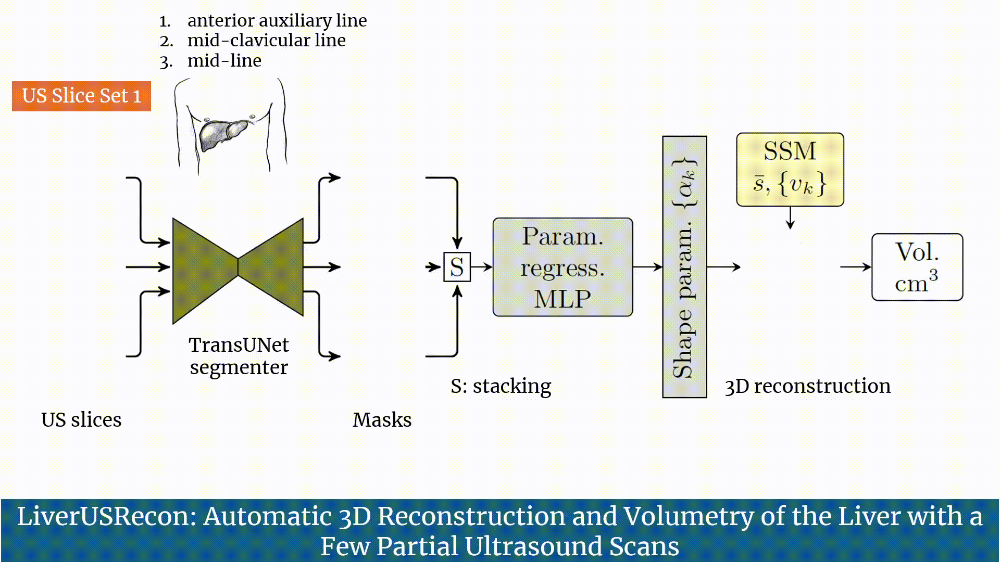
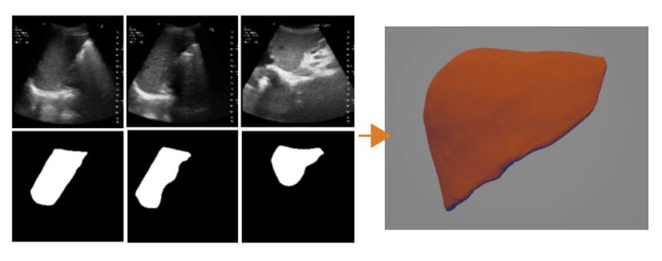
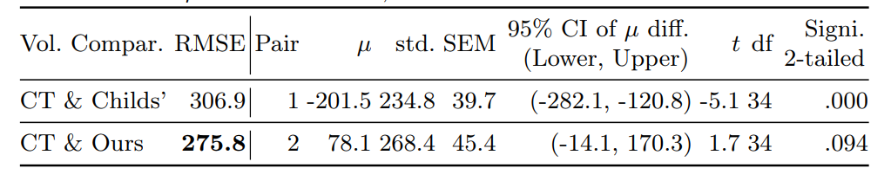
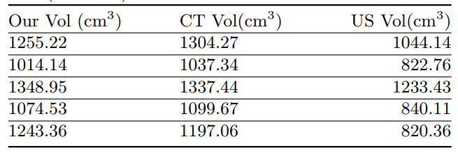

# LiverUSRecon: Automatic 3D Reconstruction and Volumetry of the Liver with a Few Partial Ultrasound Scans

# LiverUSRecon
This website holds information for [LiverUSRecon: Automatic 3D Reconstruction and Volumetry of the Liver with a Few Partial Ultrasound Scans](https://arxiv.org/pdf/2406.19336)

## 📰 News
Codes are available at (https://github.com/diagnostics4u/diagnostics4u.github.io). Weights and data will be released soon.

###  MICCAI 2024

[Kaushalya Sivayogaraj](170597a@uom.lk), 
[Sahan T. Guruge](sahang@physiol.cmb.ac.lk), [Udari Liyanage](udari@anat.cmb.ac.lk),
[Jeevani Udupihille](jeevani.udupihille@med.pdn.ac.lk),  [Saroj Jayasinghe](saroj@clinmed.cmb.ac.lk),
[Gerard Fernando](gerardf@zone24x7.com),  [Ranga Rodrigo](ranga@uom.lk), 
[Rukshani Liyanaarachchi](rukshanil@uom.lk)



3D reconstruction of the liver for volume measurement and 3D visual shape
analysis using an accessible medical imaging modality like ultrasound (US)
imaging is important. We present the first method capable of reconstructing
liver from few partial Ultrasound scans aquired at midline, midclavicular line
and anterior-auxillay line. To the best of our knowledge, this is the first automated deep learning method
that calculates the liver volume from three incomplete 2D US scans. Further,
we introduce a new US liver database with parallel, annotated CT scans
comprising 134 scans.Our volumetry results are statistically closer to the ground-truth volumes
obtained from CT scans than the volumes computed by radiologists using the
Childs’ method.

## Ultrasound segmentation and 3D reconstruction results



### 3D Reconstruction
![Overla[ between GT and prediction]](./videos/overlap.gif)


## Statistical analysis



## Volume Comparision




## Running

### 1. Download Google pre-trained ViT model
* [Download R50-ViT-B_16 models in this link](https://console.cloud.google.com/storage/vit_models/): R50-ViT-B_16
* Move the downloaded model to folder `./model/vit_checkpoint/imagenet21k/` and rename it to `R50-ViT-B_16.npz`

### 2. Prepare data

* Inference datasets will be available soon.

<!-- [BTCV preprocessed data](https://drive.google.com/drive/folders/1ACJEoTp-uqfFJ73qS3eUObQh52nGuzCd?usp=sharing)  -->

### 3. Download liver dataset SSM information

* The SSM information will be available soon.
* Once you download the SSM information, place it in the folder `./SSM/`

<!-- * [Download SSM information](https://drive.google.com/drive/folders/1ACJEoTp-uqfFJ73qS3eUObQh52nGuzCd?usp=sharing) -->

### 4. Environment

* Create an environment with python=3.7 and install the dependencies.

```bash
pip install -r requirements.txt
```

### 5. Train/Test

* Run the inference_liverusrecon script on the downloaded dataset. 
  
```bash
CUDA_VISIBLE_DEVICES=0 python inference_liverusrecon.py --inference {dataset path} --save {results path} --info {info path}
```

## Licenses

### Code Copyright (C) 2024 Zone24x7, Inc

Code is covered under the GNU Affero General Public License version 3.0
 
You should have received a copy of the GNU Affero General Public License along with the code. If not, see <https://www.gnu.org/licenses/>.


### ML Weights copyright (c) by Zone24x7, Inc

ML Weights are licensed under a
Creative Commons Attribution-NonCommercial-NoDerivs 3.0 Unported License.
 
You should have received a copy of the license along with this work. If not, see <https://creativecommons.org/licenses/by-nc-nd/3.0/>.


### Patient data copyright (c) by Zone24x7, Inc

Patient data is licensed under a
Creative Commons Attribution-NonCommercial-NoDerivs 3.0 Unported License.
 
You should have received a copy of the license along with this work. If not, see <https://creativecommons.org/licenses/by-nc-nd/3.0/>.


## Citation
If you find this project or this repository useful, please consider cite:

```bibtex
@misc{sivayogaraj2024liverusreconautomatic3dreconstruction,
      title={LiverUSRecon: Automatic 3D Reconstruction and Volumetry of the Liver with a Few Partial Ultrasound Scans}, 
      author={Kaushalya Sivayogaraj and Sahan T. Guruge and Udari Liyanage and Jeevani Udupihille and Saroj Jayasinghe and Gerard Fernando and Ranga Rodrigo and M. Rukshani Liyanaarachchi},
      year={2024},
      eprint={2406.19336},
      archivePrefix={arXiv},
      primaryClass={eess.IV},
      url={https://arxiv.org/abs/2406.19336}, 
}
```


