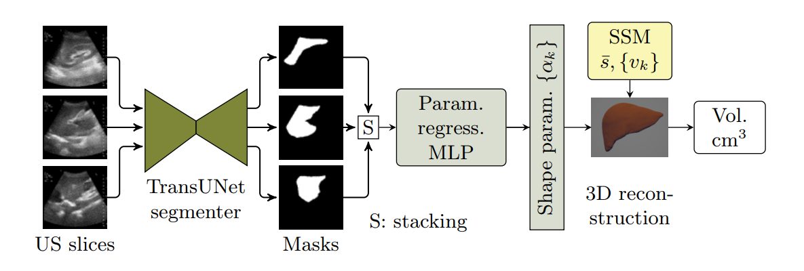
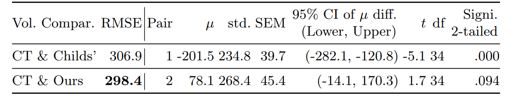

# diagnostics4u.github.io

# LiverUSRecon: Automatic 3D Reconstruction and Volumetry of the Liver with a Few Partial Ultrasound Scans

###  MICCAI 2024

[Kaushalya Sivayogaraj](170597a@uom.lk), [Sahan
Guruge](sahang@physiol.cmb.ac.lk), [Udari Liyanage](udari@anat.cmb.ac.lk),
[Jeevani Udupihille](jeevani.udupihille@med.pdn.ac.lk),  [Saroj
Jayasinghe](saroj@clinmed.cmb.ac.lk),  [Gerard
Fernando](gerardf@zone24x7.com),  [Ranga Rodrigo](ranga@uom.lk), [Rukshani
Liyanaarachchi](rukshanil@uom.lk)



3D reconstruction of the liver for volume measurement and 3D visual shape
analysis using an accessible medical imaging modality like ultrasound (US)
imaging is important. We present the first method capable of reconstructing
liver from few partial Ultrasound scans aquired at midline, midclavicular line
and anterior-auxillay line. To the best of our knowledge, this is the first automated deep learning method
that calculates the liver volume from three incomplete 2D US scans. Further,
we introduce a new US liver database with parallel, annotated CT scans
comprising 134 scans.Our volumetry results are statistically closer to the ground-truth volumes
obtained from CT scans than the volumes computed by radiologists using the
Childs’ method.

## Ultrasound segmentation and 3D reconstruction results
- [Overall framework 3D Reconstruction](./videos/3d.gif)


### 3D Reconstruction
- [Video: Overla[ between GT and prediction]](./videos/overlap.gif)
- [Video: Absoulte point to point distance](./videos/distance.gif)

## Statistical analysis



## Volume Comparision


## Citation
If you find this project or this repository useful, please consider cite:

```bibtex
@misc{sivayogaraj2024liverusreconautomatic3dreconstruction,
      title={LiverUSRecon: Automatic 3D Reconstruction and Volumetry of the Liver with a Few Partial Ultrasound Scans}, 
      author={Kaushalya Sivayogaraj and Sahan T. Guruge and Udari Liyanage and Jeevani Udupihille and Saroj Jayasinghe and Gerard Fernando and Ranga Rodrigo and M. Rukshani Liyanaarachchi},
      year={2024},
      eprint={2406.19336},
      archivePrefix={arXiv},
      primaryClass={eess.IV},
      url={https://arxiv.org/abs/2406.19336}, 
}
```

