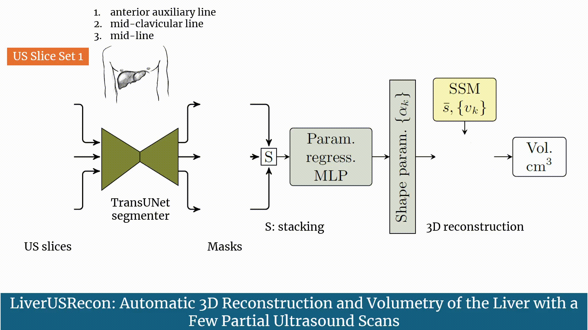
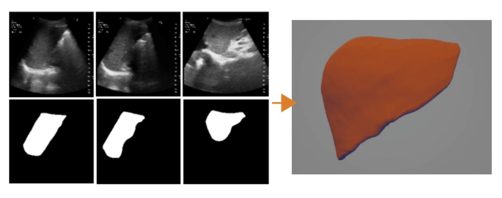
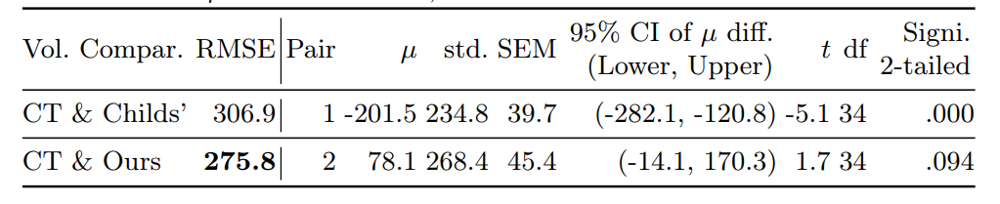
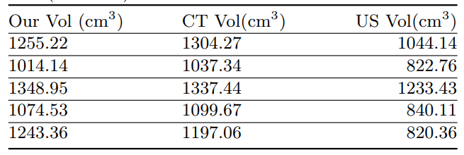

# LiverUSRecon: Automatic 3D Reconstruction and Volumetry of the Liver with a Few Partial Ultrasound Scans

> **MICCAI 2024** | [Paper (arXiv)](https://arxiv.org/pdf/2406.19336) | [Code](https://github.com/diagnostics4u/diagnostics4u.github.io/)

---

## Authors

[Kaushalya Sivayogaraj](mailto:170597a@uom.lk),
[Sahan T. Guruge](mailto:sahang@physiol.cmb.ac.lk),
[Udari Liyanage](mailto:udari@anat.cmb.ac.lk),
[Jeevani Udupihille](mailto:jeevani.udupihille@med.pdn.ac.lk),
[Saroj Jayasinghe](mailto:saroj@clinmed.cmb.ac.lk),
[Gerard Fernando](mailto:gerardf@zone24x7.com),
[Ranga Rodrigo](mailto:ranga@uom.lk),
[Rukshani Liyanaarachchi](mailto:rukshanil@uom.lk)

---

## 📰 News

- Code is available at [LiverUSRecon](https://github.com/diagnostics4u/diagnostics4u.github.io/).
- To request access to the dataset, please contact [Kaushalya Sivayogaraj](mailto:170597a@uom.lk).
- Pre-trained weights are available:
  - [Segmentation model](https://duvad-research.s3.amazonaws.com/pretrained_models/models/seg_model_epoch_100.pkl)
  - [Reconstruction model](https://duvad-research.s3.amazonaws.com/pretrained_models/models/parametric_model_epoch_100.pkl)

---

## Abstract



3D reconstruction of the liver for volume measurement and 3D visual shape analysis using an accessible medical imaging modality like ultrasound (US) imaging is important. We present the first method capable of reconstructing the liver from a few partial ultrasound scans acquired at the midline, midclavicular line, and anterior-axillary line. To the best of our knowledge, this is the first automated deep learning method that calculates the liver volume from three incomplete 2D US scans. Further, we introduce a new US liver database with parallel, annotated CT scans comprising 134 scans. Our volumetry results are statistically closer to the ground-truth volumes obtained from CT scans than the volumes computed by radiologists using the Childs' method.

---

## Results

### Ultrasound Segmentation and 3D Reconstruction



### 3D Reconstruction Overlap


### Point-to-Point Distance


### Statistical Analysis



### Volume Comparison



---

## Getting Started

### 1. Download Pre-trained ViT Model

- Download the [R50-ViT-B_16](https://console.cloud.google.com/storage/vit_models/) model from Google.
- Place the downloaded model in `./model/vit_checkpoint/imagenet21k/` and rename it to `R50-ViT-B_16.npz`.
- Download the pre-trained segmentation and reconstruction models:
  - [Segmentation model](https://duvad-research.s3.amazonaws.com/pretrained_models/models/seg_model_epoch_100.pkl)
  - [Reconstruction model](https://duvad-research.s3.amazonaws.com/pretrained_models/models/parametric_model_epoch_100.pkl)
- Place both models in a folder named `models` under the results directory.

### 2. Prepare the Dataset

- Contact [Kaushalya Sivayogaraj](mailto:170597a@uom.lk) to request access to the inference datasets.

### 3. Download Liver SSM Information

Download the following Statistical Shape Model (SSM) files and place them in `./SSM/`:

| File | Link |
|------|------|
| Shape parameters | [VT.txt](https://duvad-research.s3.amazonaws.com/pretrained_models/liver_ssm/VT.txt) |
| Mean shape | [liver_aver.obj](https://duvad-research.s3.amazonaws.com/pretrained_models/liver_ssm/liver_aver.obj) |
| PCA ratio | [pca_ratio.txt](https://duvad-research.s3.amazonaws.com/pretrained_models/liver_ssm/pca_ratio.txt) |
| Normalization info | [nor_list.txt](https://duvad-research.s3.amazonaws.com/pretrained_models/liver_ssm/nor_list.txt) |

### 4. Environment Setup

Create a Python 3.7 environment and install the required dependencies:

```bash
pip install -r requirements.txt
```
### 5. Inference

Run the inference script on the downloaded dataset:

```bash
CUDA_VISIBLE_DEVICES=0 python inference_liverusrecon.py \
  --inference {dataset path} \
  --save {results path} \
  --ssm_info {ssm_info path}
```
---

## Licenses

### Code

**Copyright © 2024 Zone24x7, Inc.**

Code is licensed under the [GNU Affero General Public License v3.0](https://www.gnu.org/licenses/).
You should have received a copy of the GNU Affero General Public License along with this code. If not, see <https://www.gnu.org/licenses/>.

### ML Weights

**Copyright © Zone24x7, Inc.**

ML Weights are licensed under the [Creative Commons Attribution-NonCommercial-NoDerivs 3.0 Unported License](https://creativecommons.org/licenses/by-nc-nd/3.0/).
You should have received a copy of the license along with this work. If not, see <https://creativecommons.org/licenses/by-nc-nd/3.0/>.

### Patient Data

**Copyright © Zone24x7, Inc.**

Patient data is licensed under the [Creative Commons Attribution-NonCommercial-NoDerivs 3.0 Unported License](https://creativecommons.org/licenses/by-nc-nd/3.0/).
You should have received a copy of the license along with this work. If not, see <https://creativecommons.org/licenses/by-nc-nd/3.0/>.

---

## Citation

If you find this work useful, please consider citing:

```bibtex
@InProceedings{Siv_LiverUSRecon_MICCAI2024,
    author    = {Sivayogaraj, Kaushalya and Guruge, Sahan I. T. and Liyanage, Udari A. and
                 Udupihille, Jeevani J. and Jayasinghe, Saroj and Fernando, Gerard M. X. and
                 Rodrigo, Ranga and Liyanaarachchi, Rukshani},
    title     = {{LiverUSRecon: Automatic 3D Reconstruction and Volumetry of the Liver
                  with a Few Partial Ultrasound Scans}},
    booktitle = {Proceedings of Medical Image Computing and Computer Assisted Intervention},
    year      = {2024},
    pages     = {436--445}
}
````
